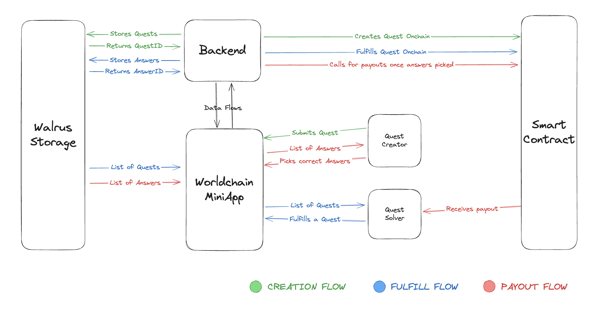

# Questly

Make money taking photos, surveys, or verifying facts, or source sybil resistant data! The goal of this project is to create a sustainable loop where real-world data can be sourced trustlessly and cheaply at scale—unlocking use cases in journalism, research, compliance, and more. ❤️

## Problem We're Solving

Sourcing niche information, especially from different parts of the world requires a big budget and time-consuming logistics for many industries like news reporting, survey collection, location based research etc

## Solution

Opening a bounty for a fee and letting anyone inside of the world app (which guarantees no bots or sybil data) fulfill the task, whether its a political survey, photo evidence of endangered species on specific location or verifying real world events.

## Architecture

## Market Opportunity

Data shows lot of the most used miniapps in worldchain ecosystem, are the ones giving away free money to users (obviously), but they generally do not bring more value apart from redistributing grant money to users and cashing some margin, we bring the first “free money” worldcoin miniapp that brings real-world value
